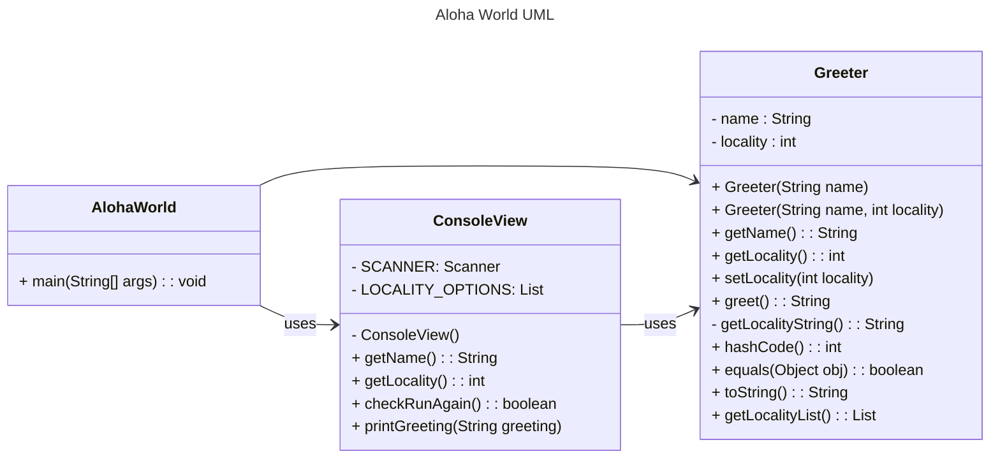

# Markdown Playground

Use this file to add example markdown elements you learned about by reading the markdown resources below. You need to add at least 3 different markdown elements you learned about, and a mermaid class diagram (of your choice does not have to follow the assignment. However, if you did use mermaid for the assignment, you can just copy that here). 

Mermaid is a markdown language that allows you to create diagrams. You can find more information about mermaid in the resources below. It has become popular enough that github has included it as an option in their markdown.  For built in markdown readers, such as the one built into IntelliJ or VSCode, you may need to install a plugin to render the mermaid diagrams. 

> [!NOTE]
> [IntelliJ Mermaid Plugin](https://plugins.jetbrains.com/plugin/20146-mermaid). Also for intelliJ, this is often installed by default, but incase it isn't [Markdown Plugin IntelliJ](https://plugins.jetbrains.com/plugin/7793-markdown). 

> [!NOTE] 
> [VS Code Mermaid Preview](https://marketplace.visualstudio.com/items?itemName=bierner.markdown-mermaid). Markdown preview is enabled by default, but if you want the full github flavored markdown, [Github Styling Preview](https://marketplace.visualstudio.com/items?itemName=bierner.markdown-preview-github-styles) is popular. 


## Markdown Resources

* [Markdown Guide](https://www.markdownguide.org/basic-syntax/)
* [Github Flavored Markdown](https://guides.github.com/features/mastering-markdown/)
* [Github Markdown Getting Started](https://docs.github.com/en/get-started/writing-on-github/getting-started-with-writing-and-formatting-on-github/basic-writing-and-formatting-syntax)
* [Mermaid Syntax Reference](https://mermaid.js.org/intro/syntax-reference.html) 


<!-- start your playground code under this dashed line -->
----

### 1. Add at least 3 different markdown elements you learned about by reading the markdown resources listed in the document.
#### 1.1. Nested Blockquotes (Example: asymptotic notation)
> **Big-O Notation (O-notation)**
>> Big-O notation represents the upper bound of the running time of an algorithm. Therefore, it gives the worst-case complexity of an algorithm.

> **Omega Notation (Ω-notation)**
>> Omega notation represents the lower bound of the running time of an algorithm. Thus, it provides the best case complexity of an algorithm.

> **Theta Notation (Θ-notation)**
>> Theta notation encloses the function from above and below. Since it represents the upper and the lower bound of the running time of an algorithm, it is used for analyzing the average-case complexity of an algorithm.

#### 1.2.Ordered Indented List
<ol>
  <li>Abstract</li>
  <li>Main Body</li>
    <ol>
        <li>Case One</li>
        <li>Case Two</li>
        <li>Case Three</li>
    </ol>
  <li>Conclusion</li>
</ol>

#### 1.3. Code Blocks (starting with an indented line)
## Below is a codeblock with javascript - with syntax highlighting
```
print("Hello world")
```


### 2. Add a mermaid class diagram (if you did use mermaid for the assignment, you can just copy that there).




### 3. Add the elements into the markdown file, so that the formatting changes are reserved to that file. 
????