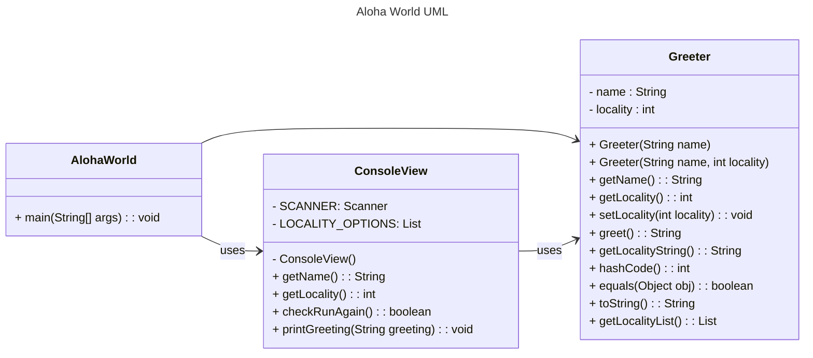

# Homework Aloha World Report

The following report contains questions you need to answer as part of your submission for the homework assignment. 

## Design Doc
Please link your UML design file here. See resources in the assignment on how to
link an image in markdown. You may also use [mermaid] class diagrams if you prefer, if so, include the mermaid code here.  
You DO NOT have to include Greeting.java as part of the diagram, 
just the AlohaWorld application that includes: [AlohaWorld.java], [Greeter.java], and [ConsoleView.java].

### Program Flow
##### Write a short paragraph detailing the flow of the program in your own words. This is to help you understand / trace the code (and give you practice of something called a code walk that will be required in this course).
- The program starts in AlohaWorld, where the main method initializes a ConsoleView object and executes the code with the objects and methods defined in other classes.
- In ConsoleView, the user can provide a name, selects a locality, view the greeting, and decide if they want to continue. 
- In this process, the method greet() of Greeter is used to generate different greetings.

## Assignment Questions

1. List three additional java syntax items you didn't know when reading the code.  (make sure to use * for the list items, see example below, the backtick marks are used to write code inline with markdown)
   
   * (example) `final class` 
   * `throw` 
   * `switch`
   * `static`

2. For each syntax additional item listed above, explain what it does in your own words and then link a resource where you figured out what it does in the references section. 

    * (example) The `final` keyword when used on a class prevents the class from being subclassed. This means that the class cannot be extended by another class. This is useful when you want to prevent a class from being modified or extended[^1] . It is often the standard to do this when a class only contains static methods such as driver or utility classes. Math in Java is an example of a final class[^2] .
    * `throw`: The `throw` keyword is used to throw an exception for a method, and it can only throw one exception at a time. [W3Schools: Java throw Keyword](https://www.w3schools.com/java/ref_keyword_throw.asp)
    * `switch`: For checking many conditions in a case, I can use `switch` instead of many `if... else` since the `switch` expression is only evaluated once [W3Schools: Java Switch Statements](https://www.w3schools.com/java/java_switch.asp#gsc.tab=0)
    * `static`: I can use `static` to create methods and attributes which can be accessed without creating an object [W3Schools: Java static keyword](https://www.w3schools.com/java/ref_keyword_static.asp)

3. What does `main` do in Java?
   - `main` is the starting point of java execution. Without a `main` method, the program may compile but will not be executed. 
   - Ref. [geeksforgeeks-Java main() Method – public static void main(String[] args)](https://www.geeksforgeeks.org/java-main-method-public-static-void-main-string-args/)

4. What does `toString()` do in Java? Why should any object class you create have a `toString()` method?
   - This method returns the string itself. It allows developer to check the any type of variable values without casting to String type. It's useful for debugging.
   - Ref. [Java String toString() Method](https://www.w3schools.com/java/ref_string_tostring.asp)

5. What is javadoc style commenting? What is it used for?
   - I can include required HTML tags inside the description part. In the end, Javadoc generates documentation formatted as HTML and via extensions. 
   - Ref. [Wikipedia - Javadoc](https://en.wikipedia.org/wiki/Javadoc)

6. Describe Test Driving Development (TDD) in your own words. 
   - It's a development methodology where writing unit tests is before coding. In this way, developers can find and fix bugs early and prevent the code from getting too complex after testing. 
   - Ref. [What is Test Driven Development (TDD)?](https://www.browserstack.com/guide/what-is-test-driven-development)

7. Go to the [Markdown Playground](MarkdownPlayground.md) and 
   * Add at least 3 different markdown elements you learned about by reading the markdown resources listed in the document. 
   * Add a mermaid class diagram (if you did use mermaid for the assignment, you can just copy that there). 
   * Add the elements into the markdown file, so that the formatting changes are reserved to that file. 

## Deeper Thinking Questions

These questions require deeper thinking of the topic. We don't expect 100% correct answers, but we encourage you to think deeply and come up with a reasonable answer. 

1. Why would we want to keep interaction with the client contained to ConsoleView?
   - Keep the App user-friendly
   - Developers can test all scenarios within one execution

2. Right now, the application isn't very dynamic in that it can be difficult to add new languages and greetings without modifying the code every time. 
   Just thinking programmatically,  how could you make the application more dynamic? You are free to reference Greeting.java and how that could be used in your design.
   - Connect the code to a database. Add new data to the table in the connected database.
   - Create another class Language.java to maintain data, and create an object of Language in Greeting.java

> [!IMPORTANT]
>  After you upload the files to your github (ideally you have been committing throughout this progress / after you answer every question) - make sure to look at your completed assignment on github/in the browser! You can make sure images are showing up/formatting is correct, etc. The TAs will actually look at your assignment on github, so it is important that it is formatted correctly.

## References

[^1]: Final keyword in Java: 2024. https://www.geeksforgeeks.org/final-keyword-in-java/. Accessed: 2024-03-30. 

[^2]: Math (Java Platform SE 17). https://docs.oracle.com/en/java/javase/17/docs/api/java.base/java/lang/Math.html. Accessed: 2024-03-30.

<!-- This is a comment, below this link the links in the document are placed here to make ti easier to read. This is an optional style for markdown, and often as a student you will include the links inline. for example [mermaid](https://mermaid.js.org/intro/syntax-reference.html) -->
[mermaid]: https://mermaid.js.org/intro/syntax-reference.html
[AlohaWorld.java]: src/main/java/student/AlohaWorld.java
[Greeter.java]: src/main/java/student/Greeter.java
[ConsoleView.java]: src/main/java/student/ConsoleView.java